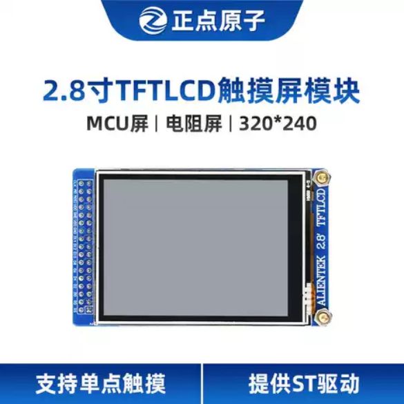
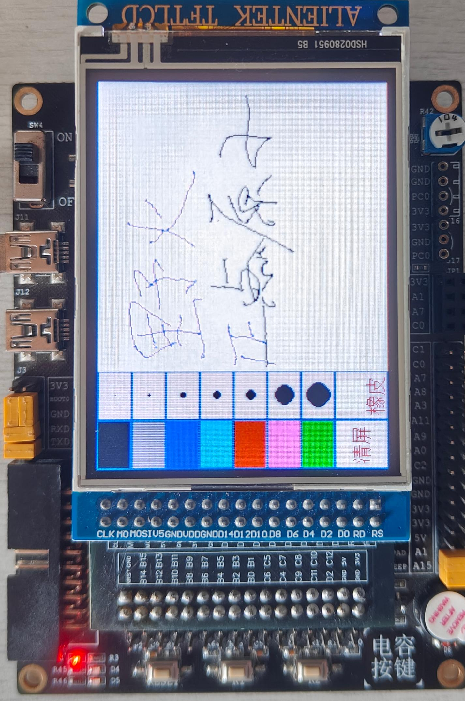

# 开发板转接板（适配F103_Mini开发板/正点原子2.8寸TFTLCD触摸屏模块）

本项目是一个用于连接开发板与 LCD 屏幕的专用转接板。

---

## 🖼️ 实物效果展示

（此处替换为你4张实物照片的展示，建议使用表格或直接排列）

## 📦 制板文件

Gerber 制板文件位于 [`gerber/`](Gerber) 文件夹内

> 组装时 **先将铜柱/螺丝固定在转接板和屏幕上**，**最后再插入排针**！  

> LCD的背光控制引脚为 **高电平有效（High-level active）**。  
