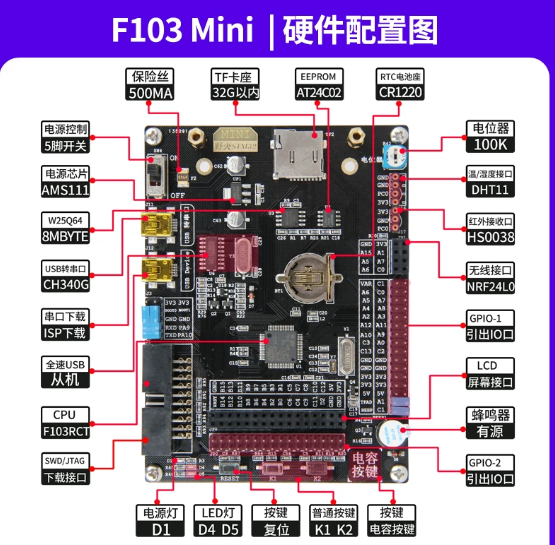
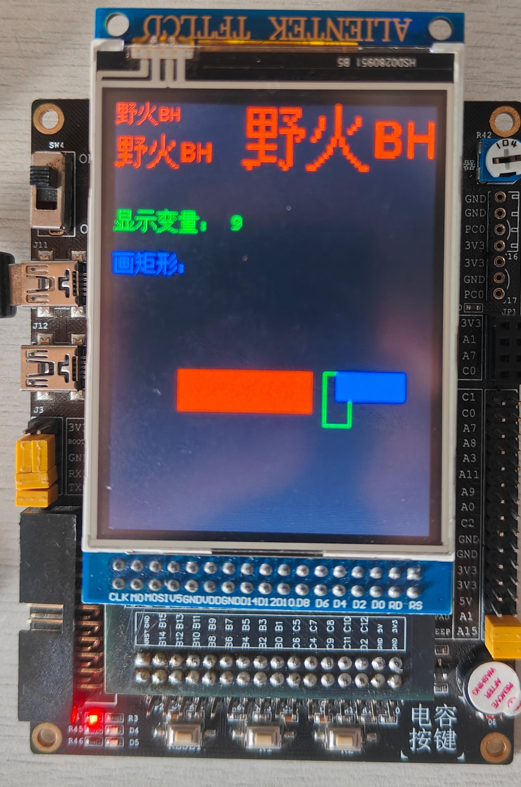
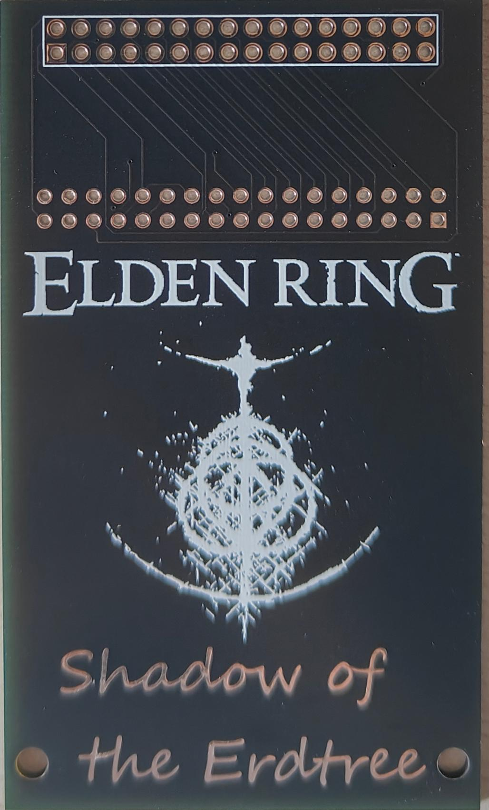
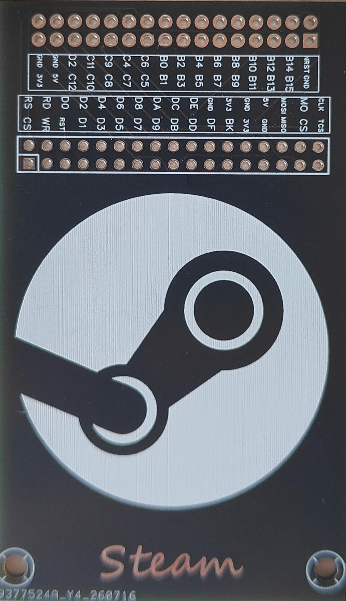

# 开发板转接板（适配F103_Mini开发板/正点原子2.8寸TFTLCD触摸屏模块）

本项目是一个用于连接开发板与 LCD 屏幕的专用转接板。

## 🖼️ 实物效果展示

<!-- 开发板图片，控制宽度为 280 像素 -->

<!-- 实物照片并排显示，每张宽度 260 像素 -->
<table>
  <tr>
    <td></td>
    <td></td>
    <td></td>
    <td></td>
  </tr>
</table>

## 📦 制板文件

Gerber 制板文件位于 [`Gerber/`](Gerber) 文件夹内

> 组装时 **先将铜柱/螺丝固定在转接板和屏幕上**，**最后再插入排针**！  

> LCD的背光控制引脚为 **高电平有效（High-level active）**。  
